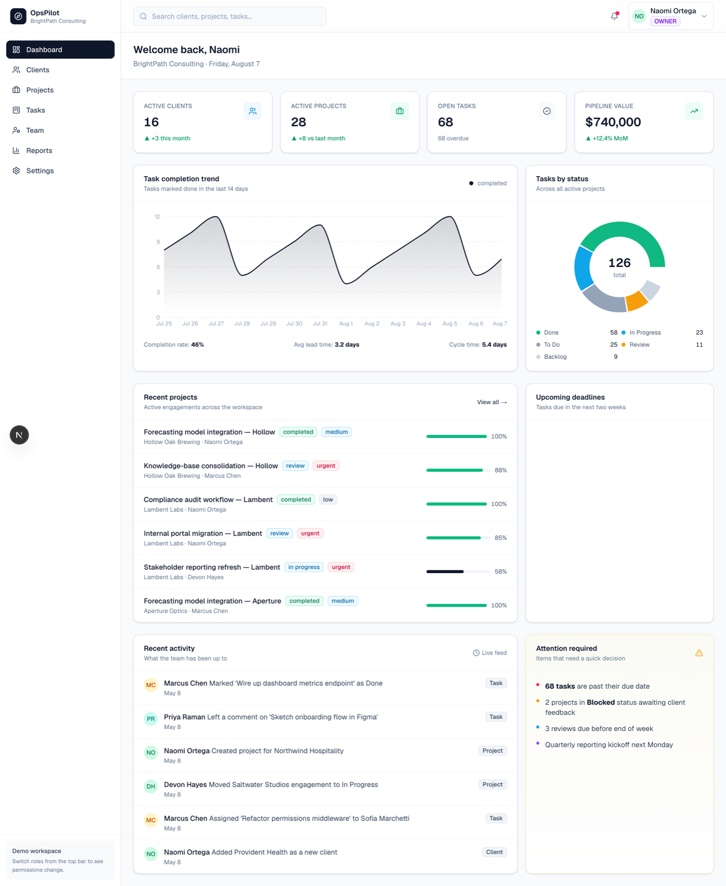
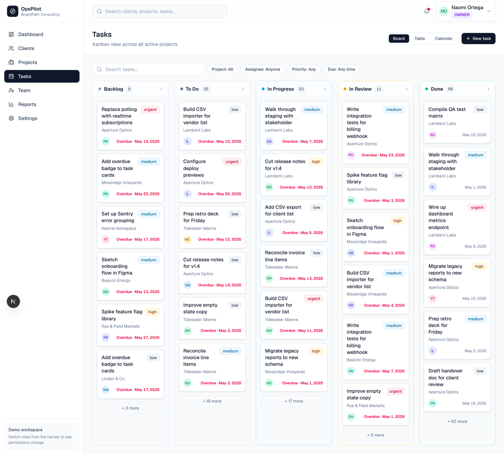
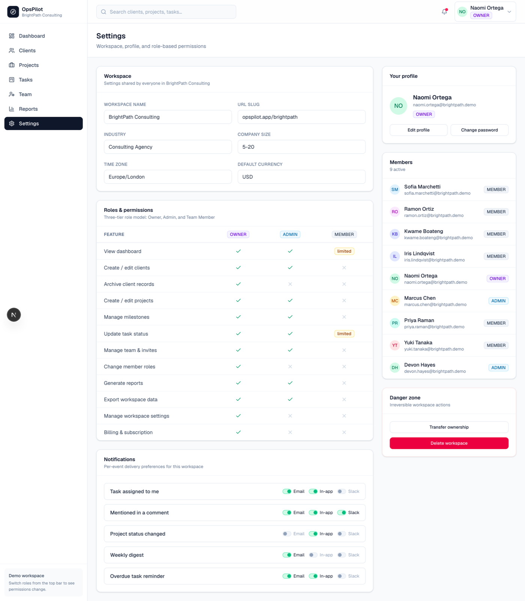

# OpsPilot

Multi-tenant SaaS operations dashboard. Portfolio piece showing a real Next.js + Prisma stack with role-based access, seeded fictional data, and a polished SaaS UI.



> **This is a portfolio demo.** All companies, people, and projects are fictional. There's no real auth — three demo roles let you preview the app from each role's perspective.

## Screenshots

| Task board | Permissions matrix |
| --- | --- |
|  |  |

## What's in here

- **Multi-tenant model** — Workspace, members, clients, projects, tasks, milestones, comments, activity log
- **Three roles** — Owner / Admin / Member with a real permissions matrix that gates what's visible and editable
- **Seeded demo data** — BrightPath Consulting workspace with 9 team members, 18 clients, 40 projects, 126 tasks
- **Pages** — Login, Dashboard, Clients (list + detail), Projects (list + detail with milestones), Tasks (kanban), Team, Reports, Settings (with permissions matrix)
- **Charts** — Recharts-driven completion trend, status donut, priority bars, industry mix
- **Server actions** — Demo-role switching, task status updates, client status updates, all running through Prisma

## Stack

| Layer | Choice |
| --- | --- |
| Framework | Next.js 16 (App Router) |
| UI | React 19, Tailwind CSS v4 |
| Server | Server actions + route handlers (Node.js) |
| Database | SQLite via Prisma (PostgreSQL-compatible schema — drop in `provider = "postgresql"` and a connection string) |
| Charts | Recharts |
| Icons | Lucide |
| Auth (demo) | Signed cookie storing the active role |

## Run it locally

```bash
# 1. Install
npm install

# 2. Apply the schema and seed the database
npx prisma migrate dev --name init
npm run db:seed

# 3. Start the dev server
npm run dev
```

Visit http://localhost:3000. You'll be redirected to `/login` where three demo-role buttons let you sign in instantly.

### Useful scripts

```bash
npm run dev          # dev server (Turbopack)
npm run build        # production build
npm run start        # serve the production build
npm run db:seed      # reseed the database
npm run db:reset     # nuke + re-migrate + reseed
```

## Repo layout

```
opspilot/
├── prisma/
│   ├── schema.prisma          # data model
│   └── seed.ts                # deterministic seed (BrightPath Consulting)
├── src/
│   ├── app/
│   │   ├── (app)/             # everything behind the demo login
│   │   │   ├── layout.tsx     # sidebar + topbar shell
│   │   │   ├── actions.ts     # server actions
│   │   │   ├── dashboard/
│   │   │   ├── clients/
│   │   │   ├── projects/
│   │   │   ├── tasks/
│   │   │   ├── team/
│   │   │   ├── reports/
│   │   │   └── settings/
│   │   ├── login/             # 3-role demo sign-in
│   │   ├── layout.tsx         # root
│   │   └── page.tsx           # / → /login or /dashboard
│   ├── components/
│   │   ├── charts/            # Recharts wrappers (area / bar / donut)
│   │   ├── layout/            # Sidebar, Topbar, PageHeader
│   │   └── ui/                # Card, Badge, StatCard, Avatar, Progress, Button, Table
│   └── lib/
│       ├── db.ts              # Prisma singleton
│       ├── auth.ts            # demo-role + session helpers + RBAC matrix
│       └── utils.ts           # cn(), date/number formatters
└── .env.example               # copy to .env before first run
```

## Promoting it from demo to real

If you want to take this past portfolio:

1. Swap SQLite for PostgreSQL in `prisma/schema.prisma` (provider) and set `DATABASE_URL` to a real Postgres connection string.
2. Replace the demo-role cookie with NextAuth / Auth.js (or your auth provider). Replace `lib/auth.ts:setDemoRole` and `getCurrentSession` with real session lookups.
3. Wire the existing `WorkspaceMember.invitedBy / status: PENDING` fields up to a real invite-email flow.
4. Add a tenancy guard middleware so every Prisma query is scoped to the active workspace by default (currently every page filters by `session.workspace.id`, which is fine for the demo).

## License

[MIT](./LICENSE) — free to use, modify, and distribute with attribution. Note that this is a
demo build: don't ship it as-is to production without doing the items in *Promoting it from
demo to real* above.
